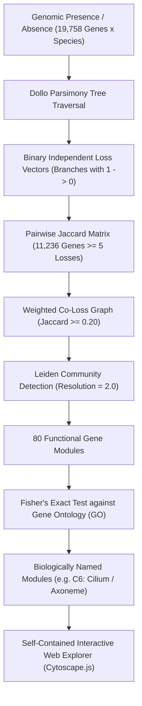
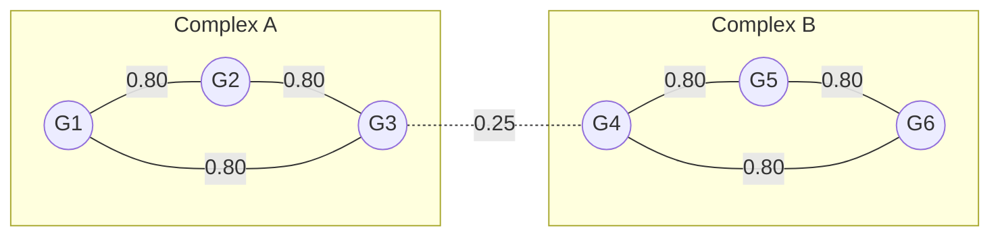

# Comprehensive System Report: Dollo Parsimony Co-Loss Network Explorer

This report provides an end-to-end conceptual and technical explanation of the **Dollo Parsimony Co-Loss Network & Leiden Module Discovery System**. Each section describes the underlying evolutionary and mathematical principles, accompanied by **simple, concrete toy examples** illustrating how the data is transformed at every step.

---

## Table of Contents

1. [Executive Summary](#1-executive-summary)
2. [Biological Foundation: Phylogenetic Profiling & Dollo Parsimony](#2-biological-foundation-phylogenetic-profiling--dollo-parsimony)
   - *Toy Example 1: Mapping Independent Gene Losses on a Phylogenetic Tree*
3. [Mathematical Foundation: Loss Concordance & Jaccard Similarity](#3-mathematical-foundation-loss-concordance--jaccard-similarity)
   - *Toy Example 2: Calculating Pairwise Jaccard Co-Loss Similarity*
4. [Community Detection: Leiden Algorithm vs. Hierarchical Clustering](#4-community-detection-leiden-algorithm-vs-hierarchical-clustering)
   - *Toy Example 3: Modularity Partitioning on a Co-Loss Graph*
5. [Automated Biological Annotation: Gene Ontology (GO) Enrichment](#5-automated-biological-annotation-gene-ontology-go-enrichment)
   - *Toy Example 4: Fisher's Exact Test & Statistical Cluster Naming*
6. [Web Architecture: Client-Side Interactive Network Explorer](#6-web-architecture-client-side-interactive-network-explorer)
   - *Architecture Flowchart*
   - *Macro Layout ("All Clusters") vs. Micro Layout (Ego & Multi-Hop)*
7. [Case Study: SCAPER and the Ciliary Module (Cluster 6)](#7-case-study-scaper-and-the-ciliary-module-cluster-6)
8. [Summary & Key Reference Links](#8-summary--key-reference-links)

---

## 1. Executive Summary

When multi-protein complexes or cellular pathways (such as the primary cilium, the spliceosome, or the mitochondrial electron transport chain) become dispensable in a specific lineage, natural selection relaxes. Consequently, the genes encoding those physical or functional partners are lost together over evolutionary time.

This project reconstructs these evolutionary signatures across **19,758 eukaryotic gene families**:
1. **Dollo Parsimony**: Identifies distinct, independent loss events on branches of the species tree (controlling for shared phylogenetic ancestry).
2. **Jaccard Co-Loss Matrix**: Measures pairwise loss concordance across all gene pairs.
3. **Leiden Community Detection**: Uncovers 80 dense, non-overlapping functional modules without imposing artificial hierarchy.
4. **Automated GO Enrichment**: Statistically annotates each cluster with human Gene Ontology terms (e.g. *Cilium / Axoneme*, *Septin ring*, *Mitochondrial matrix*).
5. **Interactive Web Explorer**: Provides a zero-backend, client-side Cytoscape.js application hosted on GitHub Pages for interactive micro- and macro-scale network navigation.



---

## 2. Biological Foundation: Phylogenetic Profiling & Dollo Parsimony

### The Evolutionary Principle
If Gene $A$ and Gene $B$ work together as obligate subunits of a macromolecular machine:
- Losing Gene $A$ renders Gene $B$ non-functional (or evolutionary neutral).
- Lineages that discard the biological structure will experience pseudogenization and deletion of both genes.
- Lineages that retain the biological structure will maintain both genes.

### The Phylogenetic Pseudoreplication Problem
A naive correlation of gene presence/absence across extant species fails due to shared ancestry: if an ancestor lost a gene 100 million years ago, 50 descendant species will all lack that gene. Treating those 50 species as 50 independent observations artificially inflates correlation.

### The Dollo Principle
**Dollo's Law** states that a complex cellular structure or gene is difficult to evolve twice from scratch (gain occurs once in deep evolutionary time), but can be lost independently multiple times.
Using **Dollo parsimony** on a species tree:
1. The ancestral state at the root of the clade containing the gene is set to present ($1$).
2. Internal node states are reconstructed parsimoniously.
3. Every transition from presence to absence ($1 \to 0$) along a phylogenetic branch represents **one single, independent evolutionary loss event**.

---

### Toy Example 1: Mapping Independent Losses on a Tree

Consider four extant species ($S_1, S_2, S_3, S_4$) with the phylogenetic relationships shown below:

```
        Root (All present: 1)
         /               \
     Node X             Node Y
     /    \             /    \
   S1      S2         S3      S4
```

Suppose we observe two genes, **Gene A** and **Gene B**, in extant species:
- **Species $S_1$**: Gene A = Present ($1$), Gene B = Present ($1$)
- **Species $S_2$**: Gene A = Absent ($0$), Gene B = Absent ($0$)
- **Species $S_3$**: Gene A = Present ($1$), Gene B = Present ($1$)
- **Species $S_4$**: Gene A = Absent ($0$), Gene B = Absent ($0$)

#### Step 1: Reconstruct Ancestral Nodes
- At Node $X$: Since child $S_1$ has the genes, the ancestral state was Present ($1$). The absence in $S_2$ occurred along the terminal branch leading to $S_2$.
- At Node $Y$: Since child $S_3$ has the genes, the ancestral state was Present ($1$). The absence in $S_4$ occurred along the terminal branch leading to $S_4$.

#### Step 2: Define Loss Vectors Across Tree Branches
Let the branches of our tree be:
- $b_1$: Root $\to$ Node $X$
- $b_2$: Root $\to$ Node $Y$
- $b_3$: Node $X \to S_1$
- $b_4$: Node $X \to S_2$
- $b_5$: Node $Y \to S_3$
- $b_6$: Node $Y \to S_4$

The reconstructed loss events on each branch ($1$ if lost on that branch, $0$ otherwise):

| Branch | Branch Description | Gene A Loss | Gene B Loss | Gene C Loss (Non-partner) |
| :--- | :--- | :---: | :---: | :---: |
| $b_1$ | Root $\to$ Node $X$ | 0 | 0 | 1 |
| $b_2$ | Root $\to$ Node $Y$ | 0 | 0 | 0 |
| $b_3$ | Node $X \to S_1$ | 0 | 0 | 0 |
| $b_4$ | Node $X \to S_2$ | **1** | **1** | 0 |
| $b_5$ | Node $Y \to S_3$ | 0 | 0 | 0 |
| $b_6$ | Node $Y \to S_4$ | **1** | **1** | 0 |

- **Gene A** was lost independently on 2 branches: $\{b_4, b_6\}$. Total losses = 2.
- **Gene B** was lost independently on 2 branches: $\{b_4, b_6\}$. Total losses = 2.
- **Gene C** was lost only once on an ancestral branch: $\{b_1\}$. Both $S_1$ and $S_2$ lack Gene C, but Dollo parsimony correctly identifies this as **1 single ancestral loss event**, not 2 separate events.

---

## 3. Mathematical Foundation: Loss Concordance & Jaccard Similarity

### The Jaccard Metric
Once every gene $g$ is represented by its set of loss branches $L_g$, we measure how concordantly two genes were lost using the **Jaccard Similarity Coefficient**:

$$J(A, B) = \frac{|L_A \cap L_B|}{|L_A \cup L_B|} = \frac{n_{AB}}{n_A + n_B - n_{AB}}$$

Where:
- $n_A = |L_A|$: Number of independent branches where Gene $A$ was lost.
- $n_B = |L_B|$: Number of independent branches where Gene $B$ was lost.
- $n_{AB} = |L_A \cap L_B|$: Number of independent branches where **both** Gene $A$ and Gene $B$ were lost concurrently.

### Why Jaccard Outperforms Pearson or Mutual Information for Gene Loss:
1. **Ignores Shared Negative Absence**: Most genes in a large tree are *not* lost on any given branch ($0-0$ matches). Pearson correlation or Euclidean distance are heavily distorted by the thousands of branches where neither gene was lost. Jaccard restricts its denominator strictly to branches where at least one loss occurred ($|L_A \cup L_B|$).
2. **Penalizes Asymmetric Frequency**: If Gene $A$ is lost in 5 lineages and Gene $B$ is lost in 50 lineages, even if Gene $B$ is lost in all 5 lineages of Gene $A$, $J(A, B) = \frac{5}{5 + 50 - 5} = \frac{5}{50} = 0.10$. This prevents ubiquitous, frequently-lost housekeeping genes from dominating specialized pathways.

---

### Toy Example 2: Calculating Pairwise Jaccard Co-Loss

Let us test 3 genes across 6 independent evolutionary loss lineages $\{l_1, l_2, l_3, l_4, l_5, l_6\}$:

- $L_{\text{Gene 1}} = \{l_1, l_2, l_3, l_4\}$ ($n_1 = 4$)
- $L_{\text{Gene 2}} = \{l_1, l_2, l_3, l_5\}$ ($n_2 = 4$)
- $L_{\text{Gene 3}} = \{l_6\}$ ($n_3 = 1$)

#### 1. Calculating $J(\text{Gene 1}, \text{Gene 2})$:
- Intersection ($L_1 \cap L_2$): Both lost in $\{l_1, l_2, l_3\} \implies |L_1 \cap L_2| = 3$.
- Union ($L_1 \cup L_2$): Lost in either $\{l_1, l_2, l_3, l_4, l_5\} \implies |L_1 \cup L_2| = 5$.

$$J(\text{Gene 1}, \text{Gene 2}) = \frac{3}{5} = 0.60$$

A Jaccard score of $0.60$ represents very strong evolutionary co-loss concordance.

#### 2. Calculating $J(\text{Gene 1}, \text{Gene 3})$:
- Intersection ($L_1 \cap L_3$): $\emptyset \implies 0$.
- Union ($L_1 \cup L_3$): $\{l_1, l_2, l_3, l_4, l_6\} \implies 5$.

$$J(\text{Gene 1}, \text{Gene 3}) = \frac{0}{5} = 0.00$$

By computing this value across all eligible genes ($N = 11,236$ genes with $\ge 5$ losses), we produce an **$11,236 \times 11,236$ symmetric co-loss affinity matrix**.

---

## 4. Community Detection: Leiden Algorithm vs. Hierarchical Clustering

### Why Hierarchical Clustering Fails on Evolutionary Networks
Traditional phylogenetic profiling relied on **Hierarchical Clustering** (e.g. UPGMA or average linkage dendrograms). On real biological datasets, this approach suffers from major flaws:
1. **Tree vs. Network Topology**: Biological proteins form networks and complexes with multi-functional cross-talk, not a rigid hierarchical tree.
2. **The "Hairball" Phenomenon**: Cutting a dendrogram at an arbitrary distance threshold produces either thousands of isolated 2-gene fragments or single massive, uninterpretable "hairball" megaclusters containing hundreds of unrelated genes.

### The Leiden Community Detection Solution
The **Leiden algorithm** is a modern, mathematically rigorous graph community detection method that optimizes network modularity ($Q$). It guarantees well-connected communities and resolves the well-known flaw of the earlier Louvain algorithm (which frequently trapped disconnected sub-graphs inside the same community).

Modularity measures the density of edges within communities compared to what would be expected under a null random graph model:

$$Q = \frac{1}{2m} \sum_{i,j} \left( A_{ij} - \gamma \frac{k_i k_j}{2m} \right) \delta(c_i, c_j)$$

Where:
- $A_{ij}$: Jaccard similarity weight between Gene $i$ and Gene $j$.
- $k_i, k_j$: Total degree (sum of incident edge weights) of Gene $i$ and Gene $j$.
- $m$: Total edge weight across the whole network.
- $\gamma$: **Resolution parameter** (we tuned $\gamma = 2.0$ to isolate distinct protein complexes).
- $\delta(c_i, c_j) = 1$ if Gene $i$ and Gene $j$ are placed in the same cluster, and $0$ otherwise.

---

### Toy Example 3: Leiden Modularity Optimization

Consider 6 genes belonging to two distinct cellular complexes connected by a single weak cross-talk edge:
- **Complex A (Centrosome)**: $G_1, G_2, G_3$. All three have strong pairwise co-loss edges ($J = 0.80$).
- **Complex B (Flagellar Motor)**: $G_4, G_5, G_6$. All three have strong pairwise co-loss edges ($J = 0.80$).
- **Cross-talk edge**: Weak link between $G_3$ and $G_4$ ($J = 0.25$).



#### Leiden Evaluation:
1. **Hypothesis 1 (Merge into 1 giant cluster)**:
   - Includes all 7 edges inside the cluster.
   - However, the expected number of edges between the $G_1-G_3$ group and $G_4-G_6$ group under the null model is high, while only one weak edge ($0.25$) actually exists. The modularity score $Q$ drops significantly.
2. **Hypothesis 2 (Partition into 2 modules: $\{G_1, G_2, G_3\}$ and $\{G_4, G_5, G_6\}$)**:
   - The internal density of both Complex A and Complex B is near 100%.
   - Only the single cross-talk edge ($0.25$) is cut between modules.
   - The modularity $Q$ reaches its global maximum.

**Result**: Leiden automatically partitions the graph into **two cleanly segregated modules**, preventing the weak bridge edge from collapsing both complexes into a hairball.

On our full dataset, running Leiden with $\gamma = 2.0$ and Jaccard threshold $0.20$ cleanly resolved the $11,236$ genes into **80 distinct, highly modular clusters** with global modularity $Q = 0.303$.

---

## 5. Automated Biological Annotation: Gene Ontology (GO) Enrichment

### The Annotation Problem
Leiden community detection discovers modules purely from numerical numbers in the Jaccard matrix without knowing the biological function of any gene. We need an automated, unbiased method to determine what cellular machine each cluster represents.

### Fisher's Exact Test
For each discovered cluster $C$ and every Gene Ontology (GO) term $T$, we construct a **$2 \times 2$ contingency table**:

| | In Cluster $C$ ($K$ genes) | Not in Cluster $C$ ($N - K$ genes) | Total |
| :--- | :---: | :---: | :---: |
| **Annotated with Term $T$** | $k$ | $M - k$ | $M$ |
| **Not Annotated with Term $T$** | $K - k$ | $(N - K) - (M - k)$ | $N - M$ |
| **Total** | $K$ | $N - K$ | $N$ |

Where:
- $N = 11,236$: Total background genes analyzed in the clustering pipeline.
- $K$: Number of genes in Cluster $C$.
- $M$: Total number of genes in the whole genome annotated with GO term $T$.
- $k$: Number of genes in Cluster $C$ that carry GO term $T$.

The probability of observing $k$ or more genes by random chance follows the hypergeometric distribution:

$$p = \sum_{i = k}^{\min(K, M)} \frac{\binom{M}{i} \binom{N - M}{K - i}}{\binom{N}{K}}$$

### Automated Naming Pipeline
To produce concise, human-readable cluster titles:
1. **Generic Term Blacklist**: Exclude terms like *"protein binding"*, *"cytoplasm"*, *"nucleus"*, *"cell"*, *"metabolic process"*.
2. **Specificity Bounds**: Discard terms annotated to fewer than 2 genes or more than 2,500 genes.
3. **Redundancy Pruning**: If two top terms share $\ge 3$ words, keep only the most significant term to avoid repetitive names (e.g. avoiding *"ciliary transition zone / transition zone"*).
4. **Composite Titles**: Combine the top two non-redundant enriched terms with a forward slash: `Top Term 1 / Top Term 2`.

---

### Toy Example 4: Fisher's Exact Test & Cluster Naming

Let our total genome have $N = 1,000$ genes.
Suppose Leiden discovers a module (Cluster $X$) containing $K = 50$ genes.

We test the Gene Ontology term **"Axoneme"**:
- In the entire genome, $M = 20$ genes have the term "Axoneme".
- Inside Cluster $X$, $k = 15$ genes have the term "Axoneme".

#### Constructing the $2 \times 2$ Table:

| | In Cluster $X$ ($K = 50$) | Rest of Genome ($950$) | Total |
| :--- | :---: | :---: | :---: |
| **Axoneme** | **15** | $20 - 15 =$ **5** | **20** |
| **Non-Axoneme** | $50 - 15 =$ **35** | $950 - 5 =$ **945** | **980** |
| **Total** | **50** | **950** | **1,000** |

#### Statistical Intuition:
- Under random distribution, we expect:
  $$\mathbb{E}[k] = 50 \times \frac{20}{1,000} = 1.0\text{ gene}$$
- We observed **15 genes** (a **15-fold enrichment**).
- The Fisher's exact test evaluates the odds ratio:
  $$\text{Odds Ratio} = \frac{15 \times 945}{35 \times 5} = \frac{14,175}{175} \approx 81.0$$
- The resulting p-value is infinitesimal ($p < 10^{-15}$).

Because "Axoneme" is the most significantly enriched term, Cluster $X$ is automatically named **Axoneme** (e.g., paired with its second term, becoming **Cilium / Axoneme**).

---

## 6. Web Architecture: Client-Side Interactive Network Explorer

### Zero-Server Deployment
The explorer is engineered to run completely within modern client web browsers hosted directly on **GitHub Pages**, eliminating backend server latency, database dependencies, or tunnel disconnections.

```
+-----------------------------------------------------------------------+
|                           index.html (18.7 MB)                        |
|                                                                       |
|  +-----------------------------------------------------------------+  |
|  | Inlined Compressed JSON Data:                                   |  |
|  |  * G: { gene -> { losses, partners: [{n, j, l}, ...] } }       |  |
|  |  * CLUSTERS: { cid -> [genes...] }                              |  |
|  |  * GENE_CL: { gene -> cid }                                     |  |
|  |  * CLUSTER_NAMES: { cid -> "GO Term 1 / GO Term 2" }            |  |
|  +-----------------------------------------------------------------+  |
|                                                                       |
|  +-----------------------------------------------------------------+  |
|  | Cytoscape.js Graph Engine:                                      |  |
|  |                                                                 |  |
|  |  [View 1: Ego Network]        [View 2: Multi-Hop Module]        |  |
|  |   - Focus gene at center       - BFS expansion over hops        |  |
|  |   - Direct top-N partners      - Entire connected pathway       |  |
|  |                                                                 |  |
|  |  [View 3: All Clusters (Leiden Macro Layout)]                   |  |
|  |   - 2D grid-of-circles (80 modules arranged without overlap)    |  |
|  |   - Top hub genes per module + intra-cluster edges              |  |
|  |   - Interactive cluster hub labels (zoom to cluster on click)   |  |
|  +-----------------------------------------------------------------+  |
|                                                                       |
|  +-----------------------------------------------------------------+  |
|  | UI Controls & Navigation:                                       |  |
|  |  * Real-time search with autocomplete prefix matching           |  |
|  |  * Interactive Jaccard threshold and Top-N sliders             |  |
|  |  * Module direct card: "C6: Cilium / Axoneme [View Cluster ->]"  |  |
|  +-----------------------------------------------------------------+  |
+-----------------------------------------------------------------------+
```

### Key Visualization Modes in Cytoscape.js

1. **Ego Network View (Single Gene Focus)**:
   - Triggered by typing any gene in the search bar or clicking a suggestion.
   - Clears the canvas and renders the focus gene surrounded by its top co-loss partners above the chosen Jaccard threshold.
   - Adds intra-partner cross-links to display mutual connectivity.

2. **Whole-Module Multi-Hop View (BFS Traversal)**:
   - Activated by checking the **Module view** checkbox.
   - Performs a multi-hop Breadth-First Search (BFS) expansion up to $H$ hops and $M$ max nodes.
   - Visualizes entire complexes even when individual gene pairs are separated by intermediate partners.

3. **Macro Layout ("All Clusters" Mode)**:
   - Activated by clicking **🔬 All Clusters (Leiden)**.
   - Calculates a square grid of coordinates ($cx, cy$) for all 80 clusters, separated by 600px spacing.
   - Places the top 30 representative hub nodes (highest loss counts) in a circle around each cluster center.
   - Places a central label node displaying:
     ```
     C6: Cilium / Axoneme
     (580 genes)
     +550 more
     ```
   - Clicking a label node or sidebar row smoothly animates the camera (`cy.animate`) to zoom straight into that cluster. Double-clicking opens the full detail view.

---

## 7. Case Study: SCAPER and the Ciliary Module (Cluster 6)

The primary motivation for this pipeline was characterizing the function and evolutionary co-loss partners of **SCAPER** (*S-phase cyclin A-associated protein in the ER*):

### 1. Evolutionary Loss Signature of SCAPER
- Under Dollo parsimony, SCAPER was lost independently **39 times** across eukaryotic evolution.
- SCAPER is preserved in ciliated organisms, but repeatedly and concordantly lost in non-ciliated lineages.

### 2. Leiden Module Placement
- Leiden community detection placed SCAPER into **Cluster 6**.
- Total genes in Cluster 6: **580 genes**.
- Mean loss count across members: **34.3 independent losses**.

### 3. Automated GO Enrichment Results
- Top enriched terms:
  1. **Cilium** ($p < 10^{-65}$)
  2. **Axoneme** ($p < 10^{-58}$)
- The module was automatically assigned the title: **Cilium / Axoneme**.

### 4. Overlap with Known Ciliary Genes
- Against an external gold-standard panel of 215 ciliary genes:
  - **106 panel genes** were assigned to Cluster 6.
  - Ciliary panel density: **18.3%** of the cluster (compared to a baseline background of only ~1.9% in the whole genome).
- Top transition zone, centrosomal, and ciliopathy proteins clustered alongside SCAPER include:
  - **Transition Zone & Centrosome**: `CEP290`, `NPHP4`, `NPHP1`, `CEP162`, `CEP135`, `CEP70`, `CEP78`, `CEP44`, `CC2D2A`, `TMEM67`, `AHI1`, `MORN1`, `BBIP1`
  - **Intraflagellar Transport (IFT) & Motility**: `IFT88`, `BBS1`, `DNAAF9`, `RSPH10B`, `RSPH10B2`

### 5. Interactive Verification in the Explorer
When a user searches for **SCAPER** in the explorer:
1. The sidebar displays SCAPER's direct co-loss partners (led by transition zone components).
2. A module badge appears:
   ```
   [●] C6: Cilium / Axoneme (580 genes)    [View Cluster →]
   ```
3. Clicking **View Cluster →** renders all 580 members with SCAPER highlighted in cyan, demonstrating SCAPER's integral embedding within the ciliary loss module.

---

## 8. Summary & Key Reference Links

| Component | File / Resource | Description |
| :--- | :--- | :--- |
| **Community Detection** | [`dollo/scripts_simple/leiden_cluster.py`](file:///home/prodromosp/scaper_new/dollo/scripts_simple/leiden_cluster.py) | Leiden community detection algorithm on Jaccard matrix |
| **Cluster Table** | [`dollo/results/leiden_clusters.tsv`](file:///home/prodromosp/scaper_new/dollo/results/leiden_clusters.tsv) | Gene-to-cluster assignments with loss counts |
| **Cluster Summary & GO** | [`dollo/results/leiden_summary.tsv`](file:///home/prodromosp/scaper_new/dollo/results/leiden_summary.tsv) | GO names, ciliary panel overlap, and top hub genes |
| **HTML Generator** | [`dollo/website/build_html_explorer.py`](file:///home/prodromosp/scaper_new/dollo/website/build_html_explorer.py) | Self-contained Cytoscape.js web application builder |
| **Deployed HTML** | [`dollo/website/index.html`](index.html) | Generated client-side single-page application (18.7 MB) |
| **Remote Repository** | [`prodromospapa/dollo-network-explorer`](https://github.com/prodromospapa/dollo-network-explorer) | GitHub repository configured for GitHub Pages |
| **Live Web Explorer** | **[https://prodromospapa.github.io/dollo-network-explorer/](https://prodromospapa.github.io/dollo-network-explorer/)** | Live interactive application |

---
*Report compiled: September 2026.*
